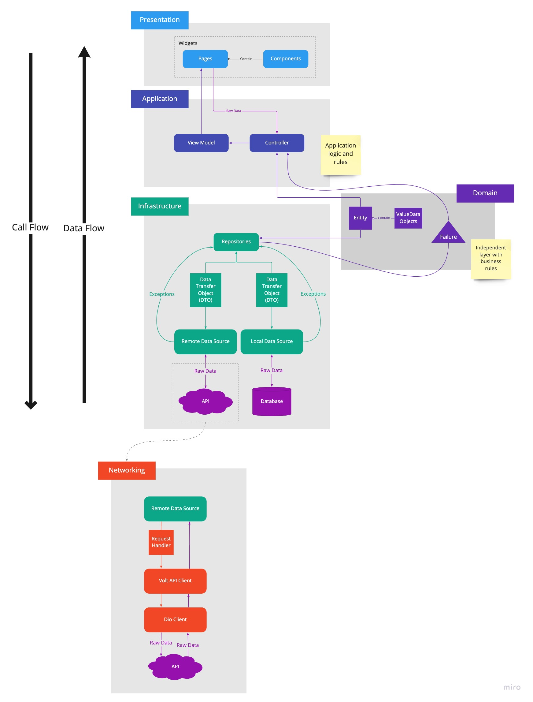

# movis

An app to check trending movies, view their information and favorite them.

## Introduction

It's a technical test for Monis.
Using Flutter with vanilla state management, injectable and get_it for dependency injection, freezed for union cases and data classes.
The architecture is based on Clean Code and DDD.

## Getting Started

1. Setup .env files: use .template_env to create the .env_dev and .env_prod files
2. `$ flutter pub get`
3. `$ flutter pub run build_runner build` (for dotenv, freezed and injectable)

# movis
